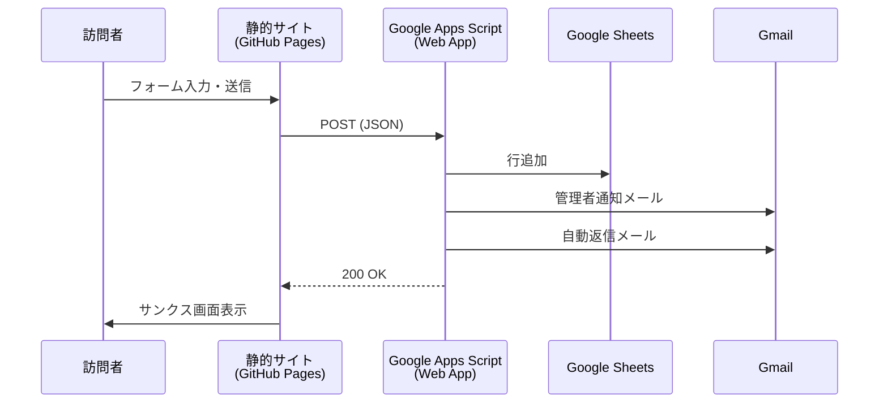
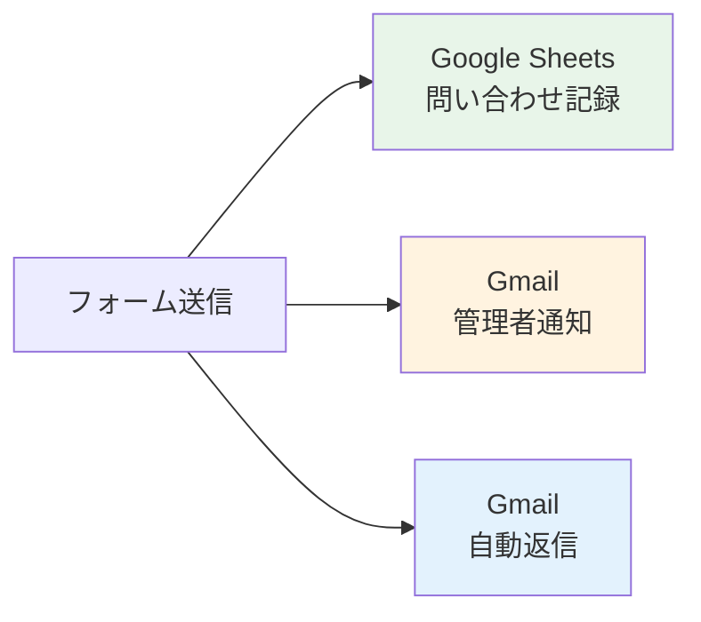

## こんな悩み、ありませんか？

「自分のサイトに問い合わせフォームを付けたい。でも…」

- Formspreeは月額かかる
- Google Formsは見た目がダサい（サイトのデザインと合わない）
- WordPressに移行するのは大げさすぎる

> **ガネーシャ**: 「なぁ、静的サイトってサーバーないから、フォームの送信先がないやんけ。どうすんねん？」
>
> **開発者**: 「Google Apps Scriptをサーバー代わりに使うんですよ。Googleアカウントさえあれば無料です」
>
> **ガネーシャ**: 「…タダ？ ホンマかいな」

ホンマです。この記事では、**GitHub Pages × Google Apps Script** で問い合わせフォームを実装し、以下の3つを月額0円で手に入れる方法を、実際のコードと一緒に紹介します。

1. **Google Sheetsに問い合わせ記録**が自動追加される
2. **管理者に通知メール**が届く（HTML形式、スプレッドシートへのリンク付き）
3. **問い合わせ者に自動返信メール**が届く

---

## 完成イメージとアーキテクチャ

### Before → After

| | Before | After |
|---|--------|-------|
| フォーム | Google Formsへの外部リンク | **サイト内インラインフォーム** |
| データ | Google Forms回答シート | **専用スプレッドシート** |
| 通知 | なし（手動で確認） | **HTML通知メール自動送信** |
| 自動返信 | なし | **info@ドメインから自動返信** |
| 月額コスト | 0円 | **0円** |

### システム構成図



ポイントは、**静的サイトからGASのWeb AppにPOST送信**するだけというシンプルさ。GASがSheets書き込みとメール送信を一手に引き受けます。

---

## Step 1 — フロントエンド（HTML + CSS + JS）

### フォームHTML

CTAセクション内にインラインフォームを配置します。ページ遷移なしで送信できるのがミソ。

<details>
<summary>フォームHTML（クリックで展開）</summary>

```html
<form class="contact-form" id="contactForm" novalidate>
  <div class="form-grid">
    <div class="form-group">
      <label for="formName">お名前 <span class="required">*</span></label>
      <input type="text" id="formName" name="name" required placeholder="山田 太郎">
    </div>
    <div class="form-group">
      <label for="formEmail">メールアドレス <span class="required">*</span></label>
      <input type="email" id="formEmail" name="email" required placeholder="example@company.com">
    </div>
    <div class="form-group">
      <label for="formCompany">会社名</label>
      <input type="text" id="formCompany" name="company" placeholder="株式会社○○">
    </div>
    <div class="form-group">
      <label for="formPhone">電話番号</label>
      <input type="tel" id="formPhone" name="phone" placeholder="03-1234-5678">
    </div>
  </div>
  <div class="form-group form-group--full">
    <label for="formCategory">ご相談カテゴリ</label>
    <select id="formCategory" name="category">
      <option value="">選択してください（任意）</option>
      <option value="月額パートナーについて">月額パートナーについて</option>
      <option value="スポット相談について">スポット相談について</option>
      <option value="その他">その他</option>
    </select>
  </div>
  <div class="form-group form-group--full">
    <label for="formMessage">ご相談内容 <span class="required">*</span></label>
    <textarea id="formMessage" name="message" rows="5" required
      placeholder="お気軽にどうぞ。"></textarea>
  </div>

  <!-- Honeypot（スパム対策 — CSSで非表示） -->
  <div class="form-hp" aria-hidden="true">
    <input type="text" name="website" tabindex="-1" autocomplete="off">
  </div>

  <div class="form-consent">
    <label class="consent-label">
      <input type="checkbox" id="formConsent" required>
      <span><a href="privacy.html" target="_blank">プライバシーポリシー</a>に同意する</span>
    </label>
  </div>
  <button type="submit" class="form-submit" id="formSubmit">
    無料で相談してみる →
  </button>
</form>

<!-- 送信成功メッセージ（初期非表示） -->
<div class="form-success" id="formSuccess" hidden>
  <h3>お問い合わせありがとうございます</h3>
  <p>2営業日以内にご連絡いたします。</p>
</div>
```

</details>

> **ガネーシャ**: 「`form-hp` ってなんやねん。HPバーか？」
>
> **開発者**: 「ハニーポットです。CSSで隠してあるフィールドで、人間には見えないけどボットは自動入力してしまう。入力があったら送信をブロックする、シンプルなスパム対策です」
>
> **ガネーシャ**: 「reCAPTCHA置かんでええんか」
>
> **開発者**: 「個人サイトのフォームならハニーポットで十分です。reCAPTCHAはユーザー体験が悪化するので、スパムが増えてからでOK」

### 送信処理（JavaScript）

<details>
<summary>送信ハンドラ（クリックで展開）</summary>

```javascript
function initContactForm() {
  const form = document.getElementById("contactForm");
  if (!form) return;

  const GAS_URL = "https://script.google.com/macros/s/YOUR_DEPLOY_ID/exec";

  form.addEventListener("submit", async (e) => {
    e.preventDefault();

    // ハニーポットチェック
    if (form.website && form.website.value) return;

    // ブラウザ標準バリデーション
    if (!form.checkValidity()) {
      form.reportValidity();
      return;
    }

    const btn = document.getElementById("formSubmit");
    const originalHTML = btn.innerHTML;
    btn.disabled = true;
    btn.innerHTML = "<span>送信中...</span>";

    const data = {
      name: form.querySelector('[name="name"]').value,
      email: form.querySelector('[name="email"]').value,
      company: form.querySelector('[name="company"]').value,
      phone: form.querySelector('[name="phone"]').value,
      category: form.querySelector('[name="category"]').value,
      message: form.querySelector('[name="message"]').value,
    };

    try {
      await fetch(GAS_URL, {
        method: "POST",
        mode: "no-cors",
        headers: { "Content-Type": "text/plain" },  // ← ここ重要！
        body: JSON.stringify(data),
      });

      // 成功 → フォーム非表示、サンクス表示
      form.hidden = true;
      const success = document.getElementById("formSuccess");
      success.hidden = false;
      success.scrollIntoView({ behavior: "smooth", block: "center" });
    } catch (err) {
      btn.disabled = false;
      btn.innerHTML = originalHTML;
      alert("送信に失敗しました。メールにて直接お問い合わせください。");
    }
  });
}
```

</details>

**最重要ポイント**: `Content-Type` は `"text/plain"` にすること。理由は後述の「ハマりポイント集」で解説します。

---

## Step 2 — バックエンド（Google Apps Script）

Google SheetsにバインドされたApps Scriptで `doPost` を実装します。

### 事前準備

1. Google Sheetsで「問い合わせ管理」シートを作成
2. ヘッダー行を設定: `タイムスタンプ | お名前 | メールアドレス | 会社名 | 電話番号 | カテゴリ | ご相談内容`
3. 拡張機能 → Apps Script を開く

### GASコード

<details>
<summary>GAS全コード（クリックで展開）</summary>

```javascript
const CONFIG = {
  ADMIN_EMAIL: "your-email@example.com",
  REPLY_FROM: "info@example.com",
  REPLY_FROM_NAME: "Your Brand",
  SHEETS_URL: "https://docs.google.com/spreadsheets/d/YOUR_SHEET_ID/edit",
};

// === メインハンドラ ===
function doPost(e) {
  try {
    const data = JSON.parse(e.postData.contents);
    writeToSheet(data);
    sendAdminNotification(data);
    sendAutoReply(data);

    return ContentService.createTextOutput(
      JSON.stringify({ result: "success" })
    ).setMimeType(ContentService.MimeType.JSON);
  } catch (error) {
    console.error("doPost error:", error);
    return ContentService.createTextOutput(
      JSON.stringify({ result: "error", message: error.toString() })
    ).setMimeType(ContentService.MimeType.JSON);
  }
}

// === Sheets書き込み ===
function writeToSheet(data) {
  const sheet = SpreadsheetApp.getActiveSpreadsheet().getActiveSheet();
  sheet.appendRow([
    new Date(),
    data.name || "",
    data.email || "",
    data.company || "",
    data.phone || "",
    data.category || "",
    data.message || "",
  ]);
}

// === 管理者通知（HTML形式） ===
function sendAdminNotification(data) {
  const subject = "【新規お問い合わせ】" + data.name + "様";

  const htmlBody = [
    '<div style="font-family: sans-serif; max-width: 600px;">',
    "<p><b>新規の問い合わせが入りました。</b></p>",
    '<table style="width:100%; border-collapse:collapse;">',
    tableRow("お名前", data.name),
    tableRow("メール", data.email),
    tableRow("会社名", data.company || "（未入力）"),
    tableRow("電話番号", data.phone || "（未入力）"),
    tableRow("カテゴリ", data.category || "（未選択）"),
    "</table>",
    '<div style="background:#f9f9f9; border-left:4px solid #e8944a; padding:16px; margin:16px 0;">',
    "<p><b>ご相談内容</b></p>",
    "<p>" + escapeHtml(data.message) + "</p>",
    "</div>",
    '<a href="' + CONFIG.SHEETS_URL + '" style="display:inline-block; padding:10px 24px; background:#e8944a; color:#fff; text-decoration:none; border-radius:4px;">スプレッドシートを開く</a>',
    "</div>",
  ].join("");

  GmailApp.sendEmail(CONFIG.ADMIN_EMAIL, subject, data.message, {
    htmlBody: htmlBody,
  });
}

// === 自動返信（プレーンテキスト） ===
function sendAutoReply(data) {
  const subject = "お問い合わせありがとうございます";
  const body = [
    data.name + " 様",
    "",
    "お問い合わせありがとうございます。",
    "以下の内容で承りました。",
    "",
    "━━━━━━━━━━━━━━━━━━",
    "お名前: " + data.name,
    "会社名: " + (data.company || "（未入力）"),
    "ご相談内容:",
    data.message,
    "━━━━━━━━━━━━━━━━━━",
    "",
    "2営業日以内にご連絡いたします。",
  ].join("\n");

  const options = { name: CONFIG.REPLY_FROM_NAME };

  // info@ が Send As エイリアスとして設定されている場合のみ差出人を変更
  try {
    const aliases = GmailApp.getAliases();
    if (aliases.indexOf(CONFIG.REPLY_FROM) !== -1) {
      options.from = CONFIG.REPLY_FROM;
    }
  } catch (e) {
    console.log("Alias check skipped:", e);
  }

  GmailApp.sendEmail(data.email, subject, body, options);
}

// === ユーティリティ ===
function escapeHtml(str) {
  return String(str)
    .replace(/&/g, "&amp;")
    .replace(/</g, "&lt;")
    .replace(/>/g, "&gt;")
    .replace(/"/g, "&quot;");
}

function tableRow(label, value) {
  return (
    '<tr><td style="padding:8px; background:#f5f5f5; font-weight:bold; width:120px; border:1px solid #ddd;">' +
    label +
    '</td><td style="padding:8px; border:1px solid #ddd;">' +
    escapeHtml(value) +
    "</td></tr>"
  );
}

// === テスト用 ===
function testDoPost() {
  const testData = {
    postData: {
      contents: JSON.stringify({
        name: "テスト太郎",
        email: "test@example.com",
        company: "テスト株式会社",
        phone: "03-1234-5678",
        category: "スポット相談について",
        message: "テスト送信です。",
      }),
    },
  };
  const result = doPost(testData);
  console.log(result.getContent());
}
```

</details>

---

## Step 3 — デプロイと接続

### GASデプロイ手順

| 設定項目 | 値 |
|---------|-----|
| 種類 | ウェブアプリ |
| 説明 | contact form |
| 次のユーザーとして実行 | 自分 |
| アクセスできるユーザー | **全員** |

> **ガネーシャ**: 「『全員』って…セキュリティ大丈夫なんか？」
>
> **開発者**: 「『全員がフォーム送信できる』であって『全員がデータを見れる』ではありません。Google Formsと同じ仕組みです。できることはSheetsに1行追加とメール送信だけ」
>
> **ガネーシャ**: 「…Google Formsと一緒って言われたら納得やな」

### 権限承認（初回のみ）

デプロイ後、**必ず `testDoPost` を手動実行**してください。初回実行時に「承認が必要です」ダイアログが表示されます。これを通さないと、外部からのPOSTが全て失敗します。

### info@エイリアス設定（任意）

自動返信を `info@` から送りたい場合:

1. **Google Admin Console** → ユーザー → 自分のアカウント → 予備のメールアドレス → `info` を追加
2. **Gmail設定** → アカウントとインポート → 他のメールアドレスを追加 → `info@ドメイン`

先に Admin Console でメールエイリアスを作成しないと、Gmailの設定でバウンスメールが返ってきます。

---

## ハマりポイント集

実装中に実際にハマった3つの罠を共有します。

### 罠1: `no-cors` × `Content-Type: application/json` = データが届かない

これが**最大のハマりポイント**でした。

```javascript
// NG — データがGASに届かない
await fetch(GAS_URL, {
  method: "POST",
  mode: "no-cors",
  headers: { "Content-Type": "application/json" },  // ← これがダメ
  body: JSON.stringify(data),
});

// OK — text/plain に変更
await fetch(GAS_URL, {
  method: "POST",
  mode: "no-cors",
  headers: { "Content-Type": "text/plain" },  // ← これで動く
  body: JSON.stringify(data),
});
```

**なぜ？** `mode: "no-cors"` の場合、ブラウザは[CORS-safelisted](https://developer.mozilla.org/ja/docs/Glossary/CORS-safelisted_request_header)でないヘッダーを**自動的に除外**します。`Content-Type: application/json` はセーフリストに含まれないため、ヘッダーが消えてGASにデータが届きません。

`text/plain` はセーフリストに含まれるので、ヘッダーが保持されます。GAS側は `e.postData.contents` でJSONを取得するため、Content-Typeが `text/plain` でも問題なく動作します。

> **ガネーシャ**: 「成功画面は出るのにデータが届かへんって、これ気づくの無理ちゃうか」
>
> **開発者**: 「そうなんですよ。`no-cors` はレスポンスが読めないので、fetchはエラーを返さない。成功したように見えて実はデータが飛んでないという…」

### 罠2: GASの権限承認を忘れる

GASをデプロイしただけでは、GmailApp や SpreadsheetApp へのアクセス権限が付与されていません。**初回は必ず `testDoPost` を手動実行**して、承認ダイアログを通してください。

### 罠3: info@メールボックスが存在しない

`info@ドメイン` から自動返信したい場合、Gmailの「他のメールアドレスを追加」だけではダメです。Google Workspace の **Admin Console で `info` をメールエイリアスとして追加**する必要があります。そうしないと、確認メールがバウンスします。

---

## まとめ — 月額0円で手に入る3つのこと



| 機能 | 実現方法 | コスト |
|------|---------|--------|
| データ記録 | GAS → Google Sheets | 0円 |
| 管理者通知 | GAS → GmailApp（HTML形式） | 0円 |
| 自動返信 | GAS → GmailApp（info@エイリアス） | 0円 |
| スパム対策 | ハニーポットフィールド | 0円 |

**次のステップ（やりたくなったら）**:
- reCAPTCHA v3 の導入（スパムが増えたら）
- Slack Webhook連携（チームで受け取りたいなら）
- フォームのステップ化（項目が増えたら）

> **ガネーシャ**: 「結局、Googleのサービスをつなぐだけで全部タダやったな」
>
> **開発者**: 「はい。静的サイトでも、GASをバックエンドに使えばサーバー不要で十分なフォームが作れます」
>
> **ガネーシャ**: 「よっしゃ、ワシのサイトにも付けてくれや」

---

*この記事は、[omoshiku.jp](https://omoshiku.jp) の問い合わせフォーム実装をベースに執筆しました。*
